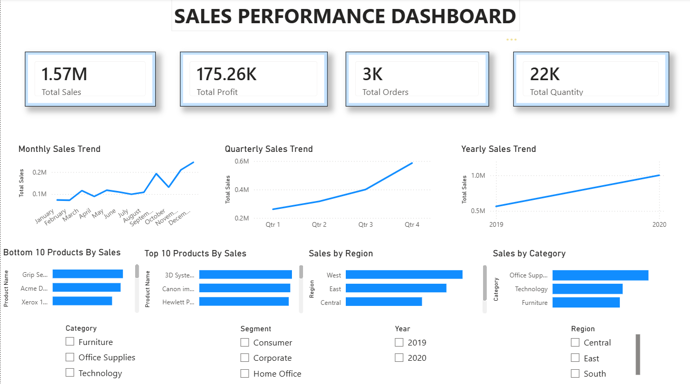

# 📊 Sales Performance Dashboard

## 📌 Project Overview

This project is an interactive **Sales Performance Dashboard** built using **Power BI**. It analyzes sales performance through key business metrics, helping users understand revenue trends, profit, product performance, and regional sales. The dashboard enables data-driven decision-making with interactive visualizations and filters.

---

## 🎯 Objectives

- Analyze monthly, quarterly, and yearly sales trends.
- Compare sales across different regions and product categories.
- Identify the top 10 and bottom 10 products by sales.
- Monitor important business KPIs.
- Build an interactive dashboard using Power BI.

---

## 🛠️ Tools & Technologies

- Power BI
- Microsoft Excel
- DAX (Data Analysis Expressions)
- Git
- GitHub

---

## 📈 Dashboard Features

- 💰 Total Sales KPI
- 📈 Total Profit KPI
- 📦 Total Orders KPI
- 🛒 Total Quantity KPI
- 📅 Monthly Sales Trend
- 📊 Quarterly Sales Trend
- 📈 Yearly Sales Trend
- 🌍 Sales by Region
- 📂 Sales by Category
- 🏆 Top 10 Products by Sales
- 📉 Bottom 10 Products by Sales
- 🎛️ Interactive Slicers (Year, Region, Category, Segment)

---

## 📂 Repository Structure

Sales-Performance-Dashboard/
│── Sales_Performance_Dashboard.pbix
│── SuperStore_Cleaned.xlsx
│── dashboard.png
│── README.md

---

## 📸 Dashboard Preview

---

# 🚀 Key Insights

- The **West** region generated the highest sales.
- **Technology** emerged as the top-performing category.
- Sales showed noticeable peaks during the end-of-year months.
- Interactive slicers allow users to explore the data by Year, Region, Category, and Segment.

---

# 👨‍💻 Author

**Kartik Dhyani**

- GitHub: https://github.com/kartikdhyani10b19-cloud
- LinkedIn: https://www.linkedin.com/in/kartik-dhyani-1b344730a?utm_source=share_via&utm_content=profile&utm_medium=member_android

